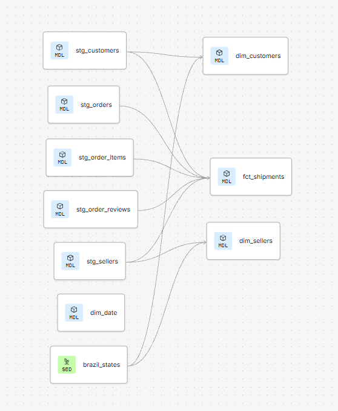

# Olist Shipping Analytics with dbt and Databricks

Where does delivery time go, which routes are late, and is the promised date realistic?
A dbt project on Databricks that turns the Olist e-commerce dataset (100k Brazilian orders, 2016 to 2018) into a tested shipping mart, with a Power BI report on top.

**Stack:** Databricks (Unity Catalog, SQL warehouse) · dbt (models, tests, docs) · Power BI



## Questions answered

1. What share of orders arrive after the promised date, and how does it trend by month?
2. Where does the time go: seller handling (approval to carrier handover) or carrier transit (handover to delivery)?
3. Which seller-state to customer-state routes are late most often?
4. What does a late delivery do to the review score?

## Findings (Work In Progress)

<!-- Fill from the analysis queries below. Replace every ~ with your actual number. -->

<!-- - **~7% of delivered orders are late.** Monthly late share peaks at ~X% in <month year> and is lowest at ~Y%.-->
<!-- - **Carrier transit dominates.** Median seller handling is ~2 days; median carrier transit is ~7 days. Improving the seller side moves little.-->
<!-- - **Worst routes:** <seller_state> → <customer_state> is late ~X% of the time (n = orders). Same-state orders are late ~Y% vs ~Z% cross-state.-->
<!-- - **Late orders score ~X on reviews vs ~Y for on-time orders.** Delivery timing is the biggest single driver of 1-star reviews in this data.-->
<!-- - **The promised date is padded.** Median promised lead time is ~23 days against a median actual of ~10. Most "on time" deliveries are a week early.-->

## Architecture

```
Kaggle CSVs ─upload─► raw.olist_shipping ─dbt─► staging (views) ─► marts (tables) ─► Power BI
                       6 string-typed tables     typed, renamed,     fct_shipments
                       (reviews via read_files,  deduplicated        dim_customers
                       see setup/)                                   dim_sellers
                                                                     dim_date
                                                                     + brazil_states seed
```

Catalogs: `raw` holds untouched source tables; `shipping_analytics` holds everything dbt builds.

## Models

| Layer | Model | Grain | Materialisation | Notes |
|-------|-------|-------|-----------------|-------|
| staging | `stg_orders` | order | view | timestamps `try_cast`, status lowercased |
| staging | `stg_order_items` | order item | view | price and freight to `decimal(10,2)` |
| staging | `stg_customers`, `stg_sellers` | entity | view | |
| staging | `stg_order_reviews` | order | view | latest review per order (source has duplicates) |
| marts | `fct_shipments` | order | table | timeline, lead times per stage, late flags, order economics |
| marts | `dim_customers`, `dim_sellers` | entity | table | state name and macro-region via seed |
| marts | `dim_date` | day | table | 2016-09-01 to 2018-12-31, ISO weekday (Monday = 1) |
| seed | `brazil_states` | state | table | 27 states, 5 IBGE macro-regions |

### Key fields in `fct_shipments`

| Field | Definition |
|-------|-----------|
| `lt_approval` | purchase → payment approval, days |
| `lt_seller_handling` | approval → handed to carrier, days |
| `lt_carrier_transit` | handed to carrier → delivered, days |
| `lt_total_delivery` | purchase → delivered, days |
| `lt_estimated_delivery` | purchase → promised delivery date, days |
| `is_late` | delivered after the promised date |
| `days_vs_estimate` | delivered date minus promised date; negative = early |
| `seller_missed_ddl` | seller handed over after their own shipping deadline |
| `freight_ratio` | freight / goods value |

## Tests

<!-- Paste the summary line from your last dbt build, e.g. "Done. PASS=38 WARN=0 ERROR=0". -->

- Generic (`unique`, `not_null`, `accepted_values`, `relationships`) on every key and on the dims' state codes against the seed.
- `accepted_values` 1 to 7 on `dim_date.day_of_week` to pin the Monday-first numbering.
- Singular: `assert_delivery_after_purchase` (no order delivered before it was bought) and `assert_late_share_is_plausible` (fails the build if the late share exceeds 30% or more than half the orders disappear, which would mean a parsing bug, not a business change).

## Design decisions

- **Raw stays raw.** All source columns are strings. Typing and renaming happen in staging, so a bad file fails a test instead of a load.
- **`try_cast` plus `not_null`, not `cast`.** `cast` aborts the whole model on one bad value; `try_cast` nulls it. The `not_null` test on `purchased_at` makes sure nulls can't hide where they shouldn't exist.
- **The reviews CSV needed a different loader.** Review comments contain line breaks. The Databricks upload UI split rows on them and shifted columns; `read_files(multiLine => true)` parses it correctly. See `setup/load_reviews.sql`. Found by a `unique` test failing with nonsense values.
- **One review per order.** The source has a few hundred orders with two reviews. Keeping the latest keeps the join 1:1; the alternative (all reviews) would multiply fact rows.
- **Fact at order grain, not item grain.** ~97% of orders have a single seller. Items are collapsed to the order with `seller_count` kept, so the simplification is visible rather than hidden.
- **Late means after the promised date, no grace period.** Simple and matches what the customer sees. `days_vs_estimate` is there for anyone who wants a different threshold.
- **Orders with no items are excluded** (inner join). A few hundred cancelled or unavailable orders have nothing to ship.
- **Unity Catalog default.** The workspace's default catalog pointed at the disabled Hive metastore, so dbt's unqualified statements failed. Fixed by setting the workspace default catalog and `+database` in `dbt_project.yml`.

## Setup

1. Databricks: create catalog `raw`, schema `raw.olist_shipping`, and upload the Olist CSVs as tables (names as in `models/staging/sources.yml`). For the reviews file run `setup/load_reviews.sql` instead of the upload UI.
2. Create catalog `shipping_analytics`. Set it as the workspace default catalog (Settings → Advanced).
3. dbt: connect to the SQL warehouse, schema of your choice. `+database` in `dbt_project.yml` points marts and staging at `shipping_analytics`.
4. `dbt build`

## Power BI (Work In Progress)

<!-- Screenshot: docs/screenshots/02-powerbi.png -->

Direct connection to `shipping_analytics`. Star schema: `fct_shipments` to `dim_customers`, `dim_sellers`, `dim_date`. One page: late share by month, median seller vs carrier days by month, worst routes with at least 100 orders.

## Data

[Brazilian E-Commerce Public Dataset by Olist](https://www.kaggle.com/datasets/olistbr/brazilian-ecommerce) (Kaggle, CC BY-NC-SA 4.0). Not included in the repo.

## What I would do next (Work In Progress)

<!-- - Add products: weight and category as drivers of freight and transit time.-->
<!-- - Seller-to-customer distance from the geolocation table.-->
<!-- - Incremental materialisation on `fct_shipments` keyed on `order_id`.-->
<!-- - A deployment job and dbt Explorer docs.-->
<!-- - Snapshot on sellers (SCD type 2) to show the pattern.-->
